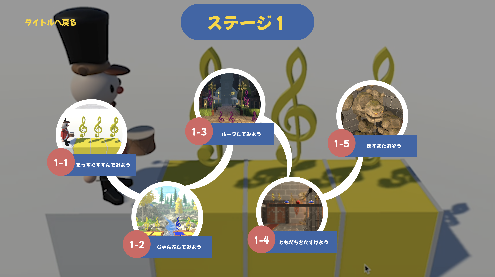

# アプリ名 れっつごーつみきくん

#### この作品はチーム制作です。
自身の担当: 全体のサブリーダーとしてwebサーバーサイド、フロントサイドの制作、ゲーム部分のスクリプト、背景の制作を行いました。

#### 動作URL
ゲーム部分
PC: [積み木くんTOP](https://halproducts.main.jp/testUpdate/screen/)
https://halproducts.main.jp/testUpdate/screen/

カメラ部分 
スマホ: [カメラアプリ](https://halproducts.main.jp/testUpdate/U22_web/camera.php)
https://halproducts.main.jp/testUpdate/U22_web/camera.php
 
この作品は積み木を使用する作品です。写真を撮ってしまうとサーバー上の写真が切り替わり積み木がないとプレイできなくなります！

web上の写真は1-2をクリアできるように積み木の写真を撮っておりますのでよろしければ1-2を写真を撮らずそのままプレイしていただけますと幸いです。
 

実行動画: [youtube](https://www.youtube.com/watch?v=Bjj6abvpqqE) 
https://www.youtube.com/watch?v=Bjj6abvpqqE
 
### 以降簡易仕様書

* 対象OS及びブラウザ   
    メインゲーム部分: PC(ブラウザ:google chrome)   
    カメラ部分: スマートフォン(safari,google chrome)

* 開発環境/言語  
  サーバーサイド:PHP 
  フロントサイド:JavaScript,sass,html 

  ゲーム部分: 開発環境 unity 言語 C# 

  画像解析:Azure Custom Vision(マイクロソフトのクラウドサービス Azureの画像解析サービス)

  
#### 概要 
    「れっつごーつみきくん」は小学３年生をターゲットとしたアルゴリズムを学べる積み木を使用したアナログ×デジタルの知育玩具です。 
    積み木一つ一つに「歩く」や「ジャンプ」「繰り返し」などの処理を持たせております。(例:黄色い正方形の積み木は「歩く」)

* まずステージを見て「つみきくん」がどのように動いたらステージの音符を全て回収できるか考える。

* 「歩く」などの指示を持った積み木を積み上げそれを専用WEBカメラアプリで撮影します。ここで画像解析が走り、積み木の形、色、座標を読み取り積まれた積み木の指示通りに「つみきくん」が動きます。

* すべての音符を取得することができればゲームクリアとなります。
* 「繰り返し」積み木を使用しもっと効率よくアルゴリズムを組み立て最小個数でのクリアを目指します

#### ページ遷移
1. トップページ screen/index.html 
   
2. ステージ選択画面 screen/stage_select.html 
   
3. 考える画面 screen/screen/thinking.html 
   
(ここで右のステージの写真を見て積み木を組み上げカメラアプリで撮影します。 カメラアプリ U22_web/camera.php) 
4. 写真を撮ったら「写真を撮ったよ」のボタンを押しゲーム画面へいくと自動的にキャラクターが積み木の指示通りに動きます。

#### フレームワーク
    フレームワークは使用しておりません

#### テーブル定義
    　この作品ではDBを使用していないためございません

#### コンセプト

    
    幼い頃、このようなおもちゃを使い、ひらがななどを学んだ方もいらっしゃるかと思います。
    アルゴリズムも同様におもちゃを用いて幼い頃から学ぶことは大事だと考えます。

    又近年、情報教育が本格化され2020年からは小学生のプログラミング教育が必修化されるなど、論理的思考力の向上と将来のIT産業の発展を見込んだ教育方針が確立されています。

    しかし、実際には児童が扱える情報教育の教材の不足により小学校に導入されたICT機器が置き物化している現状があります。

    これらのことから、誰しもが一度は触ったことのある積み木を使用し、楽しく論理的思考力を養っていただくために制作しました。

#### こだわったポイント
    できるだけアニメーションを多く制作し児童が少しでも楽しく取り組んでもらえるよう心がけました。

#### 自己評価
* 作品のコンセプトと、積み木を使用することで重力がある中で崩れないように自発的に効率の良いアルゴリズムを促すということがうまくマッチできたのではないかと思います。
* しかし画面設計図などの資料を作ることなく制作を始めてしまいとにかく使いづらいUIになってしまったと反省しております。

* ゲームの背景にこだわったため、webGLで動作するには初回読み込みがかなり重くなってしまいました。

* pcとipadを行き来するのがややこしいため端末をipadに統一するべき

* DBを使用し児童みんなが操作できるように作り直す

    これらを踏まえて現在もブラッシュアップに取り組んでおります。

    